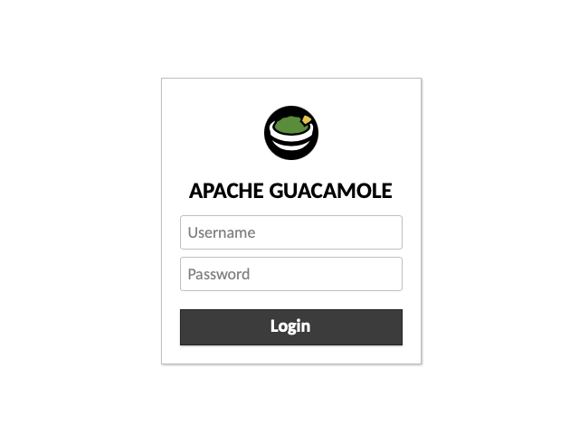

# Guacamole Docker Compose with Ansible

## About
An Ansible playbook to deploy Guacamole with Docker Compose

## Features
In addition to creating a clean install of Guacamole, this playbook also
allows you to export a MySQL database from an existing Guacamole instance and
import it into the new instance that gets generated by this playbook. 
Allowing you to semerely migrate your Guacamole installation to a new host.

## Setup
1. [Install Ansible](https://docs.ansible.com/ansible/latest/installation_guide/intro_installation.html).
2. Clone this repo: 
   `git clone https://github.com/DarkAssassin23/ansible-guacamole-docker.git`
   and enter the repo directory: `cd ansible-guacamole-docker`.
3. Install requirements: 
   `ansible-galaxy collection install -r requirements.yml`
4. Make copies of `example.config.yml` and `example.inventory.ini` and rename
   them `config.yml` and `inventory.ini` respectively. Modify them as
   desired/needed.

## Playbook Usage
Once you configured your `config.yml` and `inventory.ini` files, run the
playbook to install Guacamole with:
```bash
ansible-playbook main.yml -i inventory.ini -K
```
> [!NOTE]
> Before you run the playbook, make sure your SSH key is in the 
> `.ssh/authorized_keys` file of the user you are trying to log into. Also,
> make sure that you have accepted the host's SSH fingerprints.

Once the playbook completes, you should be able to navigate to the IP address
of the host you ran to playbook on at the given port you configured, e.g.,
`192.168.20.110:8080/guacamole/#/`. For your host, ensure the IP and port,
`192.168.20.110` and `8080` in this case, respectively, are what you
configured. Assuming everything was done properly, you should be greeted
with the following screen:



### Logging In
If you did not export an existing Guacamole database, the default credentials
will be `guacadmin` for both the username and password. If you exported
an existing Guacamole database, the username and password will be the same
as what they were on that installation.

## Guacamole Usage
For information on how to use Guacamole once it is installed, refer to the
offical Guacamole usage 
[guide](https://guacamole.apache.org/doc/gug/using-guacamole.html).
